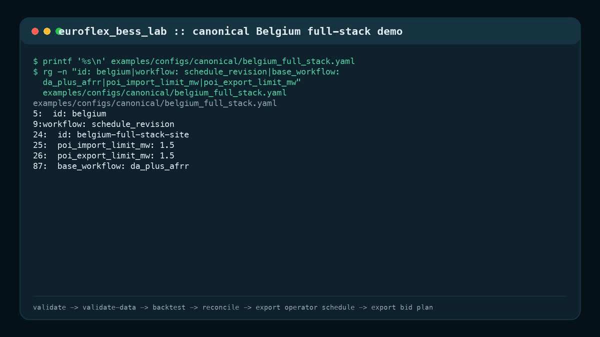
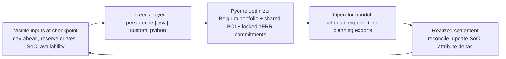

# euroflex_bess_lab


`euroflex_bess_lab` is a commercial-grade benchmarking, scheduling, revision, and audit framework for European BESS workflows. It is designed to help an operator or optimizer answer one narrow but real question with a trustworthy public-core tool:

> Given the information visible at decision time, how should a Belgium battery portfolio behind a shared POI be scheduled, revised, reconciled, and handed off to an operator?



The demo below validates the canonical Belgium config, runs a portfolio schedule revision, reconciles expected versus realized outcomes, and exports operator plus bid-planning handoff files.

This public release is the open-core base for operator-facing benchmarking, scheduling support, revision, audit, and downstream handoff in European BESS workflows. Commercial integration, managed deployment, and market-specific adapters are available separately from the public core.

## Narrow GA Promise

The first intentionally narrow GA promise is:

- Market: Belgium
- Scope: portfolio / shared POI
- Workflow: `schedule_revision`
- Base workflow: `da_plus_afrr`
- Forecast paths: `persistence`, `csv`
- Operator path:
  `validate-config -> validate-data -> backtest -> reconcile -> export-schedule --profile operator -> export-bids --profile bid_planning`
- Canonical config:
  [`examples/configs/canonical/belgium_full_stack.yaml`](examples/configs/canonical/belgium_full_stack.yaml)

Everything else is explicitly tiered:

- `perfect_foresight`: oracle-only benchmark surface
- `custom_python`: stable integration point for trusted local forecast code
- Netherlands: supported secondary surface, not part of the GA promise
- live submission / EMS control: out of scope



## Who This Is For

- BESS owners, operators, and optimizers evaluating Belgium-first scheduling and revision workflows
- flexibility aggregators and VPP teams benchmarking site or portfolio value stacking behind shared constraints
- trading, scheduling, and dispatch support teams that need operator-ready exports and bid-planning handoff
- developers, diligence teams, and revenue modelers benchmarking market-entry assumptions or private forecast models
- internal teams that want a rule-aware execution layer without rebuilding market logic from scratch

## Why It Matters

- turns visible public or private forecast inputs into auditable benchmark schedules
- keeps market rules, locked commitments, portfolio constraints, and export discipline explicit
- produces operator-ready schedule and bid-planning artifacts with manifest metadata and reconciliation
- reduces the time and integration cost of rebuilding market-specific BESS workflow logic
- separates forecast IP from deterministic market-execution logic so quantitative teams can focus on forecast alpha

## Where It Fits

- a public-core foundation for benchmark, scheduling support, revision, reconciliation, and audit workflows
- suitable for internal evaluation, PoCs, enterprise integration, and operator-facing support tooling
- intended to sit upstream of approval workflows, execution routers, and market-specific submission adapters
- not a turnkey all-market deployment surface without company-specific process and IT integration

## 5-minute Canonical Run

### Local `dl` environment

```bash
conda env update -f environment.yml
conda activate dl
euroflex validate-config examples/configs/canonical/belgium_full_stack.yaml
euroflex validate-data examples/configs/canonical/belgium_full_stack.yaml
euroflex backtest examples/configs/canonical/belgium_full_stack.yaml --market belgium --workflow schedule_revision
euroflex reconcile artifacts/examples/<run_id> examples/configs/canonical/belgium_full_stack.yaml
euroflex export-schedule artifacts/examples/<run_id> --profile operator
euroflex export-bids artifacts/examples/<run_id> --profile bid_planning
```

### Docker

```bash
docker build -t euroflex-bess-lab .
docker run --rm -v "$PWD/artifacts:/app/artifacts" euroflex-bess-lab \
  euroflex validate-config examples/configs/canonical/belgium_full_stack.yaml
docker run --rm -v "$PWD/artifacts:/app/artifacts" euroflex-bess-lab \
  euroflex backtest examples/configs/canonical/belgium_full_stack.yaml \
  --market belgium \
  --workflow schedule_revision
```

### Notebook-first

```bash
docker compose up notebooks
euroflex batch examples/batches/canonical_belgium_full_stack.yaml
```

## What It Is

- A market-rule encoder for Belgium-first BESS portfolio scheduling and revision
- A shared-POI optimizer for multi-battery sites
- A checkpoint-based revision and reconciliation engine
- A human-in-the-loop export layer with `benchmark`, `operator`, `bid_planning`, and `submission_candidate` profiles
- A local service wrapper and run-registry layer for human-in-the-loop operational integration
- A stable extension point for private forecast code through `custom_python`

## What It Is Not

- A live trading engine
- A live reserve-submission stack
- An EMS / SCADA controller
- A guarantee of realized market revenue
- A plug-and-play deployment for every market, operator, or energy company workflow

## Docs

Start with:

- [Quickstart](docs/quickstart.md)
- [Commercial positioning](docs/commercial_positioning.md)
- [Capability matrix](docs/capability_matrix.md)
- [Operator runbook](docs/operator_runbook.md)
- [Execution handoff](docs/execution_handoff.md)
- [Service API](docs/service_api.md)
- [Run registry](docs/run_registry.md)
- [Export profiles](docs/export_profiles.md)
- [Known limitations](docs/known_limitations.md)
- [BYO-ML forecast provider](docs/byo_ml_forecast_provider.md)
- [Compatibility and deprecation policy](docs/compatibility_and_deprecation_policy.md)

## Public example surface

The curated public examples are intentionally small:

- [`examples/configs/canonical/belgium_full_stack.yaml`](examples/configs/canonical/belgium_full_stack.yaml)
- [`examples/configs/reserve/belgium_da_plus_afrr_base.yaml`](examples/configs/reserve/belgium_da_plus_afrr_base.yaml)
- [`examples/configs/custom/belgium_full_stack_custom_python.yaml`](examples/configs/custom/belgium_full_stack_custom_python.yaml)
- [`examples/configs/basic/netherlands_da_only_base.yaml`](examples/configs/basic/netherlands_da_only_base.yaml)
- [`examples/batches/canonical_belgium_full_stack.yaml`](examples/batches/canonical_belgium_full_stack.yaml)

Everything else needed for tests and non-promoted scenarios lives under `tests/fixtures/`.
